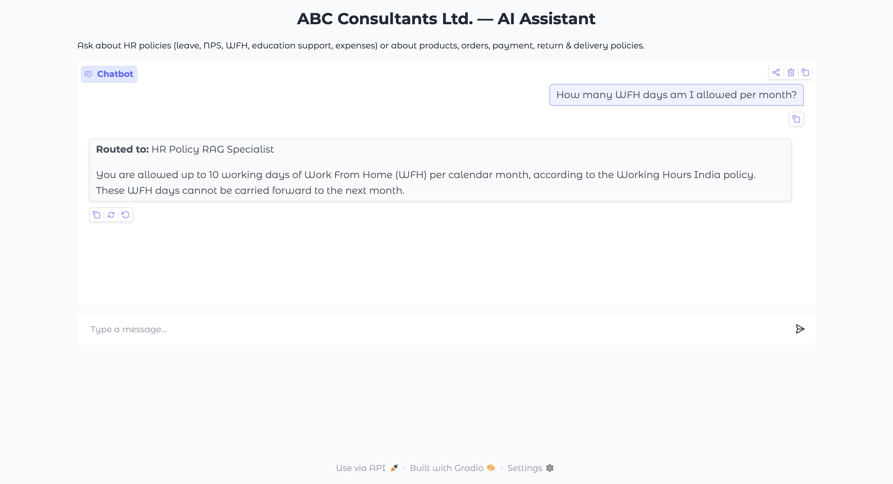

# Multi-Agent A2A Ecosystem

> Interoperable Distributed Agent System using **A2A Protocol**, **Multi-Server MCP**, **LangGraph**, **Agno**, and **Google ADK**, with **Cohere** as the LLM & embedding backbone.



---

## Architecture Overview

```
                        ┌─────────────────────────────────────┐
                        │       Gradio UI  (port 7860)        │
                        └──────────────┬──────────────────────┘
                                       │
                        ┌──────────────▼──────────────────────┐
                        │   Host Router Agent — Google ADK    │
                        │   (A2A Client, routes by intent)    │
                        └────────┬─────────────────┬──────────┘
               A2A (port 8010)   │                 │   A2A (port 8011)
                        ┌────────▼──────┐   ┌──────▼────────────┐
                        │ Remote Agent 1│   │  Remote Agent 2   │
                        │  LangGraph    │   │   Agno Workflow   │
                        │  CRAG + RAG   │   │  Product/Orders   │
                        └────────┬──────┘   └──────┬────────────┘
                    MCP (8001)   │                 │  MCP (8002 + 8003)
                        ┌────────▼──────┐   ┌──────▼──────┐  ┌──────────────┐
                        │ MCP Server 1  │   │ MCP Server 2│  │ MCP Server 3 │
                        │  Retriever    │   │  Products   │  │   Policies   │
                        │  (ChromaDB/   │   │  & Orders   │  │  (Resources) │
                        │   Cohere Emb) │   │  (CSV DB)   │  │              │
                        └───────────────┘   └─────────────┘  └──────────────┘
```

### Component Map

| Component | Framework | Port | Role |
|-----------|-----------|------|------|
| MCP Server 1 | FastMCP | 8001 | Semantic retrieval from policy PDFs |
| MCP Server 2 | FastMCP | 8002 | Product & Order CRUD (CSV) |
| MCP Server 3 | FastMCP | 8003 | Payment/Return/Delivery policy resources |
| Remote Agent 1 | LangGraph + A2A | 8010 | Corrective RAG over HR policies |
| Remote Agent 2 | Agno + A2A | 8011 | Classify → Insert/Retrieve/Policy workflow |
| Host Agent | Google ADK + Gradio | 7860 | Route user queries to correct remote agent |

---

## Quick Start

### 1. Prerequisites

```bash
# Install uv
curl -LsSf https://astral.sh/uv/install.sh | sh

# Clone / unzip project, then:
cd multi_agent_ecosystem
```

### 2. Create virtual environment & install deps

```bash
uv venv
source .venv/bin/activate   # Linux/Mac
# .venv\Scripts\activate    # Windows

uv pip install -e .
```

### 3. Configure environment

```bash
cp .env.example .env
# Edit .env — set COHERE_API_KEY at minimum
```

### 4. Add policy PDFs

Copy the five HR-policy PDFs into the `policies/` folder:

```
policies/
├── Leave_Policy_-_India.pdf
├── Higher_Education_Policy_-_India.pdf
├── NPS.pdf
├── Project_Party_Global.pdf
└── Working_Hours_India.pdf
```

### 5. Build the vector store (one-time)

```bash
python -m mcp_server_1.vector_store
```

### 6. Start all services (separate terminals)

```bash
# Terminal 1 – MCP Server 1 (RAG)
python -m mcp_server_1.server

# Terminal 2 – MCP Server 2 (Products/Orders)
python -m mcp_server_2.server

# Terminal 3 – MCP Server 3 (Policy resources)
python -m mcp_server_3.server

# Terminal 4 – Remote Agent 1 (LangGraph CRAG)
python -m remote_agent_1.server

# Terminal 5 – Remote Agent 2 (Agno Workflow)
python -m remote_agent_2.server

# Terminal 6 – Host Agent + Gradio UI
python -m host_agent.app
```

Open **http://localhost:7860** in your browser.

---

## Sample Queries

| Query | Routed To |
|-------|-----------|
| "What is the maternity leave policy?" | Remote Agent 1 (RAG) |
| "How many WFH days are allowed per month?" | Remote Agent 1 (RAG) |
| "Show me all Electronics products with stock > 50" | Remote Agent 2 (Retrieve) |
| "Insert a new product: ..." | Remote Agent 2 (Insert) |
| "What is the return policy?" | Remote Agent 2 (Policy) |

---

## Project Structure

```
multi_agent_ecosystem/
├── pyproject.toml
├── .env.example
├── README.md
├── data/
│   ├── products.csv          # 100 sample products
│   └── orders.csv            # 50 sample orders
├── policies/                 # ← Drop your PDFs here
├── common/
│   ├── __init__.py
│   └── a2a_types.py          # Shared A2A Pydantic models
├── mcp_server_1/             # RAG Retriever MCP
│   ├── server.py
│   └── vector_store.py
├── mcp_server_2/             # Product & Order MCP
│   └── server.py
├── mcp_server_3/             # Policy Resources MCP
│   ├── server.py
│   └── policy_docs/
│       ├── payment_modes.md
│       ├── return_policy.md
│       └── delivery_modes.md
├── remote_agent_1/           # LangGraph CRAG + A2A server
│   ├── graph.py
│   └── server.py
├── remote_agent_2/           # Agno Workflow + A2A server
│   ├── workflow.py
│   └── server.py
└── host_agent/               # Google ADK Router + Gradio
    ├── a2a_client.py
    ├── agent.py
    └── app.py
```

---

## LLM & Embedding Models

| Usage | Model |
|-------|-------|
| LLM (all agents) | `command-r-plus-08-2024` via `ChatCohere` |
| Embeddings | `embed-english-v3.0` via `CohereEmbeddings` |

---

## Agent Cards

### Remote Agent 1 – HR Policy RAG Specialist
- **Skills**: leave_policy_qa, education_policy_qa, nps_policy_qa, working_hours_qa, project_party_qa
- **Capabilities**: streaming, semantic retrieval, web-search fallback, self-corrective re-ranking

### Remote Agent 2 – Product & Order Manager
- **Skills**: product_retrieval, order_retrieval, product_insert, order_insert, policy_lookup
- **Capabilities**: structured classification, CSV CRUD, policy resource lookup
